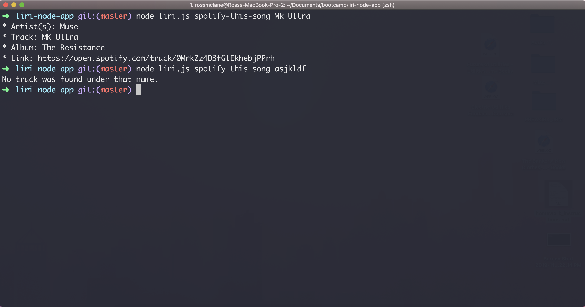

# liri-node-app

* This App is a command-line tool to search Spotify Tracks, OMDB Movies, and SeatGeek Events easily from your terminal! No browser needed.

* The app uses routes different functions and their corresponding search terms into different functions, which then access the corresponding api to retrieve that information if it is found. The main functions are:
  * spotify-this-song
  * movie-this
  * concert-this
  * do-what-it-says

* Instructions to use:
0. Clone the repository to your local computer
1. Run npm install
2. Commands should be structured `node liri.js {command} {query arguments}`
3. The command must be run in the downloaded folder. Queries can have spaces and the command must be chosen from one of the above commands

Functioning Application Screenshot

* Technologies
  * Node
  * Moment
  * node-spoitfy-api
  * dotenv

Functioning Application Screenshot

State your role in the app development
